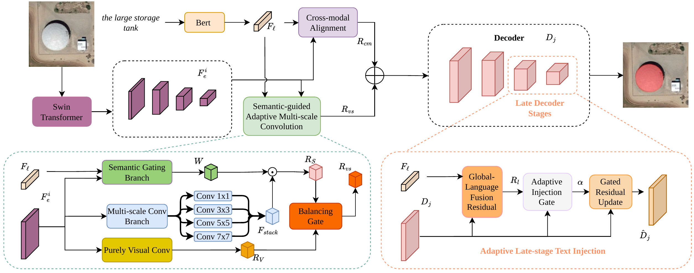

# DLSA

Official implementation of **DLSA: Dual-Level Semantic Alignment with
Adaptive Multi-Scale Modeling for Referring Remote Sensing Image
Segmentation**, accepted to EMNLP 2026.

## News

- **August 2026:** DLSA was accepted to EMNLP 2026.
- Code and trained models are available in this repository.

## Models

We provide final checkpoints trained on RefSegRS and RRSIS-D through our
[Hugging Face model repository](https://huggingface.co/qklqkl/DLSA).

| Dataset | Checkpoint | SHA-256 |
|---|---|---|
| RefSegRS | [DLSA-RefSegRS](https://huggingface.co/qklqkl/DLSA/resolve/main/dlsa_refsegrs.pth) | `a4cfa5d0e5ee338643c56027b6737b8919c1a3d5739fe61755dce7dd3081ac18` |
| RRSIS-D | [DLSA-RRSISD](https://huggingface.co/qklqkl/DLSA/resolve/main/dlsa_rrsisd.pth) | `f6c9e514e18e602fc058706b7f0243c2c42ef68e1a37a27f5c0c777e09a84047` |

Place downloaded checkpoints under `checkpoints/` as
`dlsa_refsegrs.pth` and `dlsa_rrsisd.pth`. The public checkpoints contain the
model parameters and configuration required for evaluation; optimizer states
are intentionally omitted.

## Framework

<p align="center">
  <a href="assets/framework.pdf">
    
  </a>
</p>

DLSA performs semantic alignment at both the multi-scale visual encoding and
mask decoding stages. The implementation is organized around the SgAMC
modules in `sgamc/` and the adaptive language-guided decoder modules in
`alti/`.

## Installation

The reference environment uses Python 3.7, PyTorch 1.13.1, torchvision
0.14.1, and CUDA 11.7.

```bash
conda env create -f environment.yml
conda activate dlsa
```

Alternatively, create a Python 3.7 environment, install PyTorch 1.13.1 with
CUDA 11.7, and then run `pip install -r requirements.txt`.

## Preparation

### Datasets

Download RefSegRS and RRSIS-D from their official project pages. This
repository does not redistribute either dataset. Arrange them as follows:

```text
datasets/
|-- RefSegRS/
|   |-- images/
|   |-- masks/
|   |-- output_phrase_train.txt
|   |-- output_phrase_val.txt
|   `-- output_phrase_test.txt
`-- RRSIS-D/
    |-- rrsisd/
    |   |-- refs(unc).p
    |   `-- instances.json
    `-- images/
        `-- rrsisd/
            `-- JPEGImages/
```

The data roots can be changed through the `DATA_ROOT` environment variable
in every provided script.

### Initial Weights

Download the BERT-base-uncased files to `bert-base-uncased/` and the Swin
Transformer base checkpoint to:

```text
pretrained_weights/swin_base_patch4_window12_384_22k.pth
```

The supplied DLSA checkpoints are sufficient for evaluation. To initialize
training from a compatible segmentation checkpoint, set `INIT_CHECKPOINT`.

## Training and Inference

Train DLSA:

```bash
bash scripts/train_refsegrs.sh
bash scripts/train_rrsisd.sh
```

Evaluate the released checkpoints:

```bash
bash scripts/test_refsegrs.sh
bash scripts/test_rrsisd.sh
```

Use `SPLIT=val` to evaluate the validation split. GPU IDs and paths can be
overridden without editing the scripts, for example:

```bash
GPU=1 SPLIT=val CHECKPOINT=/path/to/model.pth \
  DATA_ROOT=/path/to/RefSegRS bash scripts/test_refsegrs.sh
```

## Acknowledgements

This code is built on RMSIN/LAVT. We thank the authors of RMSIN, LAVT, Swin
Transformer, BERT, MMCV, and the RefSegRS and RRSIS-D datasets for making
their work publicly available.

## Citation

The final BibTeX entry will be added after the EMNLP 2026 proceedings are
published.

## License

This repository is released under the GNU General Public License v3.0. See
`LICENSE` and `THIRD_PARTY.md` for details.
